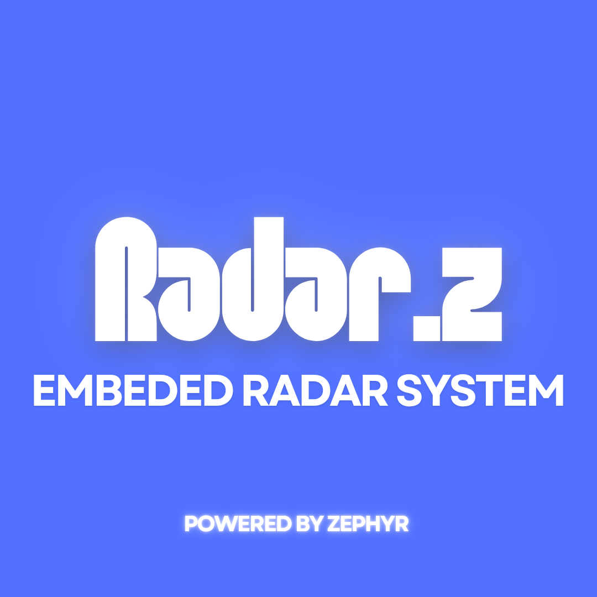

<div align="center">
  
</div>

<div align="center" style="display: flex; justify-content: center; align-items: center; gap: 20px;">
  
  
</div>

# RAD.Z

RAD.Z is an embedded systems project using Zephyr RTOS. It was created during the 2024.2 semester at the Federal University of Alagoas (UFAL), as part of the course "Embedded Systems" (ECOM042) ministated by Professor Rodrigo J. S. Peixoto.

## 📋 Project Description

The project consists of a simple embedded system for a traffic violation radar detection system. It uses two sensors separated by a distance (configurable via Kconfig) to detect the speed of a vehicle passing between them. If the vehicle exceeds a predefined speed limit (also configurable), it triggers the camera module. The system is designed to be modular and easily configurable.

## 🏗️ Architecture

The system is built using a multi-threaded architecture with Zephyr's ZBUS message passing system for inter-thread communication. The main components are:

- **Sensor Module**: Detects vehicle passage and calculates speed
- **Camera Service**: Captures license plate data when violations occur
- **Display Module**: Shows system status and violation information
- **System Thread**: Main control logic that coordinates all components
- **Network Thread**: Handles network operations (NTP time sync)

## ⚙️ Configuration Options (Kconfig)

The following options can be configured through Kconfig:

### Radar Configuration
- `CONFIG_RADAR_SENSOR_DISTANCE_MM`: Distance between sensors in millimeters (default: 5000)
- `CONFIG_RADAR_SPEED_LIMIT_KMH`: Speed limit in km/h for violation detection (default: 60)
- `CONFIG_SIMULATE_PROCESSING_TIME`: Enable processing time simulation (default: y)
- `CONFIG_RADAR_PROCESSING_TIME_MS`: Processing time in milliseconds (default: 500)

### Feature Flags
- `CONFIG_SIM_CAR_PASSAGE`: Enable car passage simulation for testing
- `CONFIG_TEST_SNTP`: Enable SNTP time synchronization testing (default: y)
- `CONFIG_ZTEST`: Enable unit testing mode
- `CONFIG_DUMMY_DISPLAY`: Enable dummy display driver (default: y)

### Network Configuration
- `CONFIG_NET_SAMPLE_SNTP_SERVER_ADDRESS`: SNTP server address (default: "a.st1.ntp.br")
- `CONFIG_NET_SAMPLE_SNTP_SERVER_PORT`: SNTP server port (default: 123)
- `CONFIG_NET_SAMPLE_SNTP_SERVER_TIMEOUT_MS`: Response timeout (default: 1000)

## 🧵 Threads

### Sensor Thread (`sensor_thread`)
- **Priority**: 2
- **Stack Size**: 1024 bytes

Manages GPIO sensors (sw0/sw1 aliases), calculates vehicle speed and publishes speed events to `velocidade_chan`. At startup, it initializes the sensors and sets up GPIO interrupts. When both sensors are triggered in sequence, it calculates the vehicle's speed based on the time difference and configured distance.

### System Thread (`system_thread`)
- **Priority**: 1 (highest)

Main control logic for violation detection and camera triggering. Subscribes to velocity events and triggers the camera service when speed violations are detected. Handles license plate validation using Mercosul standards and displays violation information.

### Display Thread (`display_thread`)
- **Priority**: 4

Manages the auxiliary display device for showing system status, violation alerts, and license plate information. Subscribes to display channel messages and updates the display accordingly.

### Camera Thread (`camera_thread`)
- **Priority**: 3

Simulates camera operations for license plate capture. Responds to capture commands and publishes camera events with either captured license plate data or error codes. Includes simulation of processing delays and random success/failure scenarios.

### Network Thread (`network_thread`)
- **Priority**: 4

Handles network operations including NTP time synchronization for accurate timestamping of violations.

## 📡 ZBUS Channels

The system uses the following ZBUS channels for inter-thread communication:

- `sensor_chan`: Publishes sensor trigger events
- `velocidade_chan`: Publishes calculated speed events
- `display_chan`: Publishes display update messages
- `chan_camera_cmd`: Camera command channel
- `chan_camera_evt`: Camera event/response channel

## 🚗 License Plate Validation

The system supports Mercosul standard license plates for the following countries:

- **Brasil**: LLL N L NN (e.g., ABC1D23)
- **Argentina**: LL NNN LL (e.g., AB123CD)
- **Paraguai (Carro)**: LLLL NNN (e.g., ABCD123)
- **Paraguai (Moto)**: NNN LLLL (e.g., 123ABCD)
- **Uruguai**: LLL NNNN (e.g., ABC1234)
- **Bolivia**: LL NNNNN (e.g., AB12345)

Where L = Letter and N = Number.

## 📁 Project Structure

```
projeto_radar/
├── src/
│   ├── main.c              # Main application entry point
│   ├── sensor.c            # Sensor management and speed calculation
│   ├── display.c           # Display thread implementation
│   └── system_thread.c     # Main system logic and plate validation
├── include/
│   ├── sensor.h            # Sensor module interface
│   ├── display.h           # Display module interface
│   ├── system_thread.h     # System thread interface
│   └── net_sample_common.h # Network utilities
├── camera_service/
│   ├── src/
│   │   └── camera_service.c # Camera service implementation
│   └── include/
│       └── camera_service.h # Camera service interface
├── tests/
│   ├── sensor/
│   │   └── test_sensor.c    # Sensor unit tests
│   └── validar_placa/
│       └── test_validacao.c # License plate validation tests
├── Kconfig                  # Configuration options
└── readme.md               
```

## 🔨 Building the Project

1. Set up Zephyr development environment
2. Clone this repository to your Zephyr workspace
3. Build the project:
   ```bash
   west build --pristine -b qemu_cortex_m3 . &&
   west build -t run
   ```


## 🧪 Testing

The project includes unit tests:

### Sensor Tests
Located in `tests/sensor/test_sensor.c`:
- Basic speed calculation validation
- Edge cases (zero time, zero distance, negative values)
- High-speed scenarios

### License Plate Validation Tests
Located in `tests/validar_placa/test_validacao.c`:
- Tests for all supported Mercosul countries
- Invalid plate format detection

Run tests with:

```bash
west twister -p qemu_cortex_m3 -T tests/validar_placa
```

And 

```bash
west twister -p qemu_cortex_m3 -T tests/sensor
```

## 🚀 Usage

The system operates in two modes: normal operation and simulation mode. In normal operation, it continuously monitors for vehicle passages and functions as normal, but since this is not a real physical system, we have to rely on simulated inputs. In simulation mode, you can enable `CONFIG_SIM_CAR_PASSAGE` to simulate vehicle passages for testing purposes.

1. **Normal Operation**: The system continuously monitors for vehicle passage
2. **Simulation Mode**: Enable `CONFIG_SIM_CAR_PASSAGE` to simulate vehicle passages
3. **Speed Violation**: When speed exceeds the configured limit, camera captures license plate
4. **Display Output**: System status and violations are shown on the display

## 👥 Authors

- Students: 
  - Reinaldo M. Assis (@reinaldoassis)
  - Matheus M. Rodrigues (@Matheus-Rodrigues-1892)
- Professor: Rodrigo J. S. Peixoto
- Institution: Federal University of Alagoas (UFAL)
- Course: ECOM042 - Embedded Systems
- Semester: 2024.2